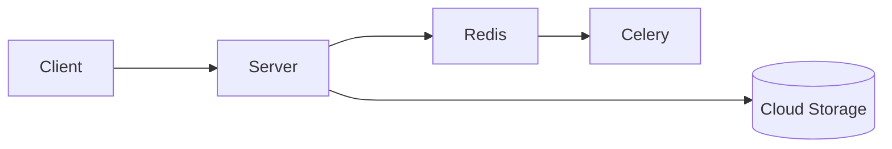

# Backend
Central component of the [Latent Space Explorer](https://lse.neanias.eu) is the server. It exposes API that serves to make CRUD operation on cloud storage. Furthermore, in order to execute long task like calculate clustering, a scheduler is deployed. Redis is used as queue for celery.



# Data structure
The data are organized into file and folders in a cloud storage. Currently the only cloud storage that could be used is NextCloud. In future release we plan to connect more storage vendors.

## Custom experiments
It represents experiments whose owner is the user. Each user create a folder with pattern: "lse-\<user-mail\>" and shares it with the service account in order to make it visible to the service.

Experiments in that folder need to have the following structure:

```
- lse-<user1-mail>
- lse-<user2-mail>
  - demo-<exp1-name>
  - demo-<exp2-name>
    - metadata.json
    - embeddings.json
    - data-<user1-mail>
    - data-<user2-mail>
      - clusters
        - metadata.json
        - ...
      - reductions
        - metadata.json
        - ...
  - demo-<exp-3-name>
```
## Demo experiments
It represents experiments visible to all users. Main data like embeddings, metadata.json and images are stored in the root of the demo folder. Other data that needs to be manipulated by users are stored in custom folders named "data-\<user-mail\>".

```
- lse-demo
  - demo-<exp1-name>
  - demo-<exp2-name>
    - metadata.json
    - labels.json
    - ids
    - images
      - im1.png
      - im2.png
      - ...
    - data-<user1-mail>
    - data-<user2-mail>
      - clusters
        - metadata.json
        - ...
      - reductions
        - metadata.json
        - ...
    - data-<userN-mail>
  - demo-<expN-name>
```
