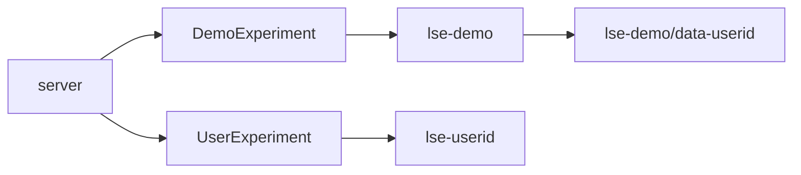

# Server and scheduler

The choice to have server and scheduler in the same repo is that the celery worker need to be code paired with the tasks launched by the server.

# Demo project
Demo are stored in service space
The structure is like so:
- lse-demo
  - demo-mnist-autoencoder
  - demo-celeba-autoencoder
    - metadata.json
    - embeddings.json
    - data-thomas.cecconello@unimib.it
    - data-user2
      - clusters
      - reductions

This approach limit the amount of data replicated

Similar approach could inspire a rearrangmenet of files:
- dataset1
  - exp1
  - exp2
  - exp3

Rispetto a:
- exp1
  - dataset1
- exp2
  - dataset1
- exp3
  - dataset1

When user list experiments, a background job add the user folder inside each demo project

Manca da sistemare POST, DELETE. Deattivare delete in caso di demo project (al massimo metteremo un HIDE button sul client)
Per il POST bisogna sistemare i celery task

Il DELETE continua ad essere chiamato dal client se non si risponde con 200 OK. Agire sul client
Per ora gli torniamo un fake 200 e via andare
